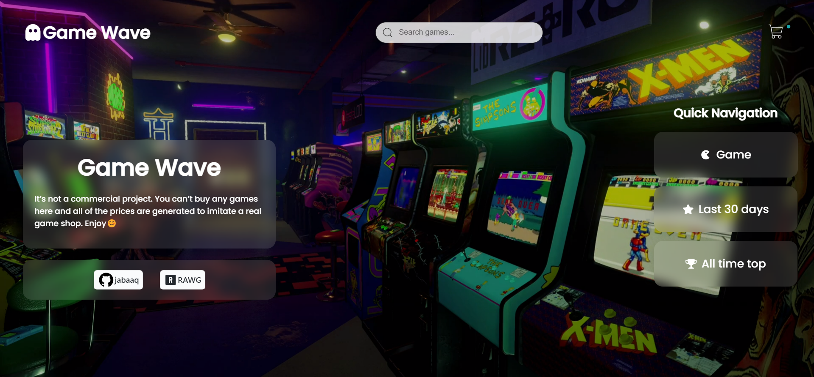
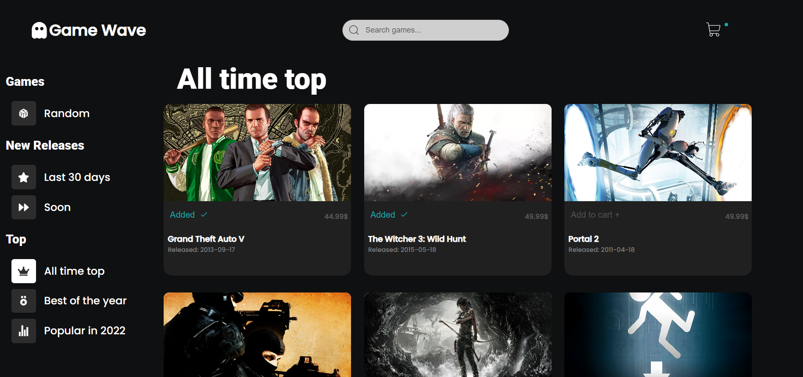
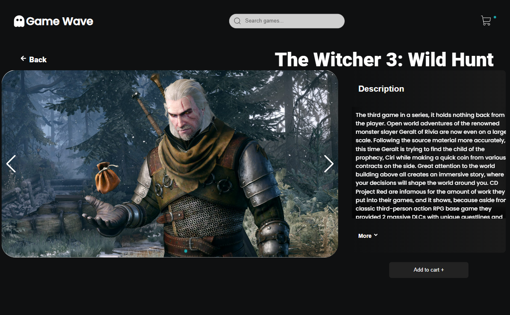
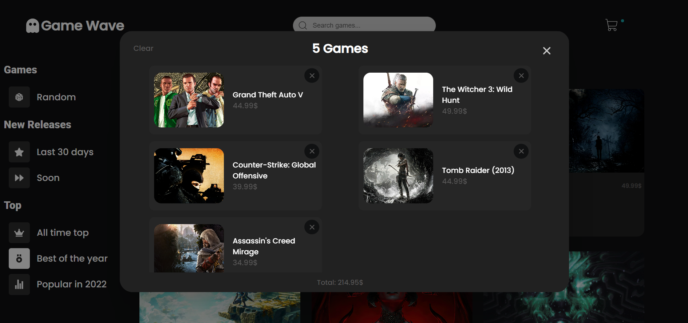

<h1 align='center'>Game Wave</h1>

<h2>Demo</h2>

🔥 [Live Demo](https://game-wave.vercel.app/)

<h2>Built with</h2>
- React
- Swiper 
- Frame Motion
- RAWG API

<h2>Features</h2>

- Extensive catalog of games thanks to the [RAWG API](https://rawg.io/apidocs).
- Search any game you want.
- Game information and screenshots.
- Responsive design.
- Cart for games user wants to 'buy'

<h2>Screenshots</h2>

